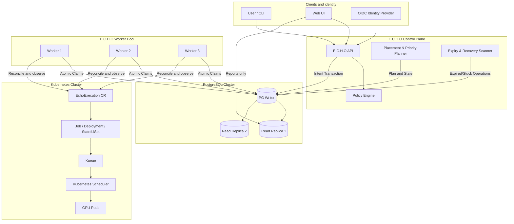

# Overview

_Source: `docs/specification/E.C.H.O.pdf`, pp. 1–4._

## Purpose

E.C.H.O — **Erez Compute Host Operations** — is a web-based GPU orchestration platform built on top
of Kubernetes. It provides a unified interface for submitting, scheduling, monitoring, and managing
AI compute operations across three workload types:

- long-running inference services
- time-bound research environments
- time-bound training jobs

PostgreSQL is the central source of truth for requests, queues, policies, metadata, and audit
history. E.C.H.O workers safely reconcile this desired state with Kubernetes, while Kueue manages GPU
quota admission and Kubernetes schedules workloads onto GPU nodes.

The platform uses organizational users and groups to enforce access, priorities, limits, and fair
resource sharing.

E.C.H.O's purpose is to simplify access to shared AI infrastructure, maximize GPU utilization,
prevent conflicting allocations, and provide reliable lifecycle management from job submission and
admission through execution, monitoring, cancellation, expiration, and completion.

_Spec p.1_

## System ownership

| Concern | Authority |
| --- | --- |
| User request and desired state | PostgreSQL writer |
| Workflow/reconciliation queue | PostgreSQL writer |
| User, group and policy snapshot | PostgreSQL |
| Target cluster and resource plan | PostgreSQL |
| Logical GPU admission | Kueue |
| Pod-to-node placement | Kubernetes scheduler |
| Actual workload state | Kubernetes API |
| Reporting and dashboards | PostgreSQL replicas |
| GPU telemetry | Prometheus/DCGM, summarized into PostgreSQL |

> PostgreSQL can report runtime state, but that state is a projection of Kubernetes, not an
> independent truth.

_Spec p.2_

## High-level architecture

Transcribed from the page-3 diagram.

**Clients and identity**

- `User / CLI` and `Web UI` both call the `E.C.H.O API`.
- `OIDC Identity Provider` feeds identity into the `E.C.H.O API`. **Superseded by D7:** the
  deployment constraint is LDAP only, so there is no OIDC provider — the API binds against the
  directory and issues its own session. The diagram is left as the spec drew it.
- The `Web UI` additionally has a `Reports only` edge into the PostgreSQL cluster. **Derived:** per
  the ownership table, reporting reads belong on the replicas, not the writer.

**E.C.H.O Control Plane**

- `E.C.H.O API` — consults the `Policy Engine`, and writes the `Intent Transaction` to the PG writer.
- `Placement & Priority Planner` — writes `Plan and State` to the PG writer.
- `Expiry & Recovery Scanner` — writes `Expired/Stuck Operations` to the PG writer.
- `Policy Engine`.

**PostgreSQL Cluster**

- `PG Writer` — the single write endpoint; replicates to `Read Replica 1` and `Read Replica 2`.

**E.C.H.O Worker Pool**

- `Worker 1`, `Worker 2`, `Worker 3` — take `Atomic Claims` against the PG writer, and
  `Reconcile and observe` against the Kubernetes cluster.

**Kubernetes Cluster**

- `EchoExecution CR` → `Job / Deployment / StatefulSet` → `Kueue` → `Kubernetes Scheduler` →
  `GPU Pods`.

**Derived:** the same structure as a graph.

_Spec p.3 (diagram)_

## Worker roles

The E.C.H.O worker has three logical roles:

- **Queue consumer** — claims operations from PostgreSQL.
- **Executor/reconciler** — materializes desired state in Kubernetes.
- **Observer** — watches Kubernetes and projects runtime status back to PostgreSQL.

These can begin as one Go service with several replicas. They can be split later if scale requires
it.

_Spec p.4_
