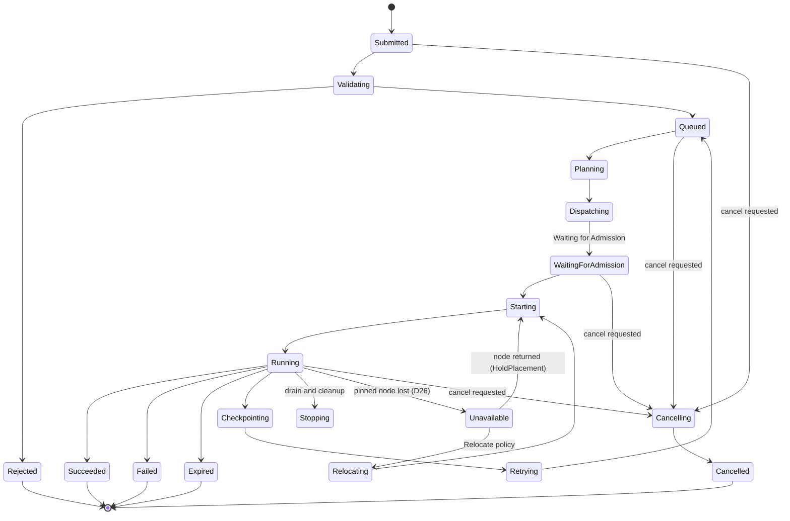

# Core domain objects

_Source: `docs/specification/E.C.H.O.pdf`, pp. 4–7._

## Worker roles

The E.C.H.O worker has three logical roles:

- **Queue consumer** — claims operations from PostgreSQL.
- **Executor/reconciler** — materializes desired state in Kubernetes.
- **Observer** — watches Kubernetes and projects runtime status back to PostgreSQL.

These can begin as one Go service with several replicas. They can be split later if scale requires
it.

_Spec p.4_

## Execution attempt

A logical operation can have multiple physical attempts:

```
Training operation
├── Attempt 1 → failed because node disappeared
├── Attempt 2 → failed because image was invalid
└── Attempt 3 → succeeded
```

Each attempt receives a deterministic identity:

```
echo-<operation-id>-a<attempt-number>
```

Retry creation must happen through one PostgreSQL transaction that increments the attempt number.
**Workers must never independently invent a new attempt.**

_Spec p.5_

## EchoOperation and EchoExecution

**D26.** The specification describes only `EchoExecution`, which is *attempt*-scoped — `echo-7d91a2-a1`,
carrying an `echo.erez.io/attempt` label (p.5). That makes it the wrong owner for anything which must
outlive a single attempt, such as an inference model's pinned node. An operation-scoped parent sits above
it:

```text
EchoOperation: echo-7d91a2
├── EchoExecution: echo-7d91a2-a1
├── EchoExecution: echo-7d91a2-a2
└── ...
```

| Location | Responsibility |
| --- | --- |
| PostgreSQL desired state | User intent, recovery policy and desired generation |
| `EchoOperation.status` | Persistent operation placement, availability and current attempt |
| `EchoExecution.status` | Attempt-specific workload state |
| Pod | Ephemeral runtime instance |

A new `EchoExecution` inherits its placement from the parent, so the pin survives attempt replacement.
PostgreSQL stays authoritative for the *requested* recovery policy; `EchoOperation.status` is
authoritative for the *observed* placement, because runtime placement is a cluster fact (p.2: "actual
workload state → Kubernetes API"). Full rationale and the status shape are in
[`06-decisions.md`](06-decisions.md#d26--echooperation-an-operation-scoped-parent-resource).

Owner references now cascade from the operation: `EchoOperation` → `EchoExecution` → Jobs, Services and
PVCs, so p.6's automatic garbage collection deletes the whole tree.

## EchoExecution CR

The Kubernetes-side execution anchor, for example:

```yaml
apiVersion: operations.echo.erez.io/v1alpha1
kind: EchoExecution
metadata:
  name: echo-7d91a2-a1
  namespace: echo-project-vision
  labels:
    echo.erez.io/operation-id: 7d91a2
    echo.erez.io/attempt: "1"
spec:
  operationID: 7d91a2
  operationGeneration: 4
  type: Training
  desiredState: Running
  queue: team-vision
  priorityClass: standard-training
  resources:
    gpu:
      flavor: a100-80gb
      count: 8
  workload:
    image: registry.example.com/training/model:v12
    command: [...]
```

This CR is a derived execution snapshot, **not the system of record**. PostgreSQL remains
authoritative.

> **Read `workload` as type-dependent (D27).** Above, `image` is the *submitter's* image, which is the
> Research and Training model: the user supplies a complete image and E.C.H.O treats it as opaque. For
> Inference, `image` is **E.C.H.O's own versioned vLLM runtime** and `command` is not user-supplied —
> a declarative model specification (weight references, adapters, vLLM configuration, GPU requirements)
> takes its place, and E.C.H.O materializes the Pod, configuration, storage access, Service and route.
>
> **Ownership follows scope.** The Pod is attempt-scoped, so `EchoExecution` owns it. The Service and
> external route must survive attempt replacement to be a *stable* endpoint, so they hang off
> `EchoOperation` (D26) — an attempt-scoped owner would delete and recreate them on every retry.

It gives E.C.H.O:

- A Kubernetes object that can own Jobs, Services and PVCs.
- Automatic garbage collection using owner references.
- A deterministic local identity.
- A place for cluster-local status.
- Easier inspection through `kubectl`.

_Spec pp.5–6_

## Job lifecycle

Transcribed from the page-7 diagram, titled *E.C.H.O Compute Operation Lifecycle — PostgreSQL-centric
orchestration · from submission to GPU execution*.

**01 · Intake** — `Submitted` → `Validating`. `Validating` → `Rejected` (terminal).

**02 · Queue & plan** — `Queued` → `Planning` → `Dispatching`.

**03 · Admission** — `Waiting for Admission` → `Starting`.

**04 · Execution** — `Running`.

**05 · Outcomes** — `Succeeded` (terminal), `Failed` (terminal), `Expired` (terminal).

**Recovery paths** — `Running` → `Checkpointing` → `Retrying` → back to `Queued`. `Running` →
`Stopping` (*drain and cleanup in progress*).

> **Superseded by D16.** `Checkpointing` is not a lifecycle phase. It means recording the
> operation's orchestration milestones, which happens *continuously* as status is reconciled, so the
> state is removed. Note also that `Retrying` returns to `Queued`, not `Starting` — a retry is
> re-planned and re-admitted, and gets its own immutable plan and attempt number.
>
> **Extended by D26.** Two non-terminal states the diagram does not contain handle the loss of a pinned
> inference node. `Failed` is deliberately not used for a temporary outage, since it is terminal
> (invariant #7) and a maintenance reboot must not permanently kill a production model:
>
> ```text
> HoldPlacement:  Running → Unavailable → Starting → Running
>                               │
>                               └── wait for the pinned node
>
> Relocate:       Running → Unavailable → Relocating → Starting → Running
> ```
>
> Under `HoldPlacement` the operation waits and E.C.H.O recreates the Pod on the same node when it
> returns. Under `Relocate`, relocation increments `placement.generation` and permits a new node.
> **Derived:** these apply to operations with a persistent placement — inference. Training and research
> node loss follows D17's retry path instead, having no pin to wait for.

**Cancellation path** — a cancel request from any non-terminal stage (intake, queue & plan,
admission, execution) leads to `Cancelling` → `Cancelled` (terminal).

Diagram legend: normal lifecycle · checkpoint and retry · cancellation request · terminal state.

**Derived:** the same states as a graph.



Terminal states must never move backward:

```
Succeeded
Failed
Cancelled
Expired
Rejected
```

_Spec p.7_
